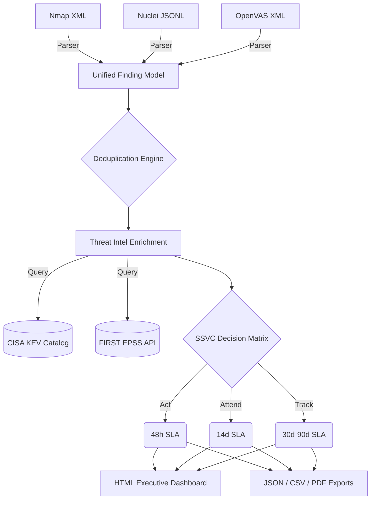

# Vuln2Risk: Explainable Vulnerability Prioritization Pipeline 🎯🛡️

An open-source vulnerability triage pipeline that turns noisy, multi-scanner output into an explainable remediation queue using real-world exploitability, asset exposure, and the SSVC framework.

Modern vulnerability management products recognize that CVSS alone is insufficient. Vuln2Risk automates the correlation of raw scan data with live threat intelligence to produce defensible, SLA-driven patching decisions with clear explainability for engineering teams.

---

## 🌟 The Impact: Signal Over Noise

Vuln2Risk transforms verbose scanner output into concise, actionable metrics. In a standard lab test against a Metasploitable instance, Vuln2Risk took **463 raw alerts** across Nmap and Nuclei, grouped them into **44 unique component upgrades**, and identified that only **6 components required immediate action**.

For every high-priority finding, Vuln2Risk provides a transparent "Priority Spotlight" justification so engineers know exactly *why* a patch is urgent:

*   **✓ CISA KEV listed**
*   **✓ EPSS: 100.0% exploitation probability**
*   **✓ Internet-facing asset**
*   **✓ High-criticality system**
*   **Decision:** SSVC → ACT (48-hour SLA)

---

## 🧠 System Architecture Diagram



## 🚀 Installation & Local Usage

Ensure you have Python 3.8+ installed.

```bash
# Clone the repository
git clone https://github.com/alrightatharva/vuln2risk.git
cd vuln2risk

# Install dependencies (Rich for CLI UI, PyTest for testing)
pip install -r requirements.txt

# Run the pipeline
python vuln2risk.py --nmap sample_data/nmap_scan2.xml --nuclei sample_data/report1.json --criticality High --internet-facing --csv
```

## 🐳 Docker Deployment

Vuln2Risk is fully containerized, allowing you to run the pipeline without configuring a local Python environment.

### 1. Build the Docker Image

```bash
docker build -t vuln2risk .
```

### 2. Run the Container (with Volume Mapping)

Because the container is isolated, you must map your local data and report directories using the `-v` flag so the tool can read your scans and save the output to your host machine.

**Windows (PowerShell):**

```powershell
docker run --rm `
  -v ${PWD}/sample_data:/app/sample_data `
  -v ${PWD}/reports:/app/reports `
  vuln2risk --nmap sample_data/nmap_scan2.xml --nuclei sample_data/report1.json --criticality High --internet-facing
```

## ⚙️ Command Line Arguments

| Argument | Description | Default |
|---|---|---|
| `--nmap` | Path to Nmap XML output file | None |
| `--nuclei` | Path to Nuclei JSONL output file | None |
| `--openvas` | Path to OpenVAS XML output file | None |
| `--criticality` | Asset business value (Low, Medium, High, Critical) | Medium |
| `--internet-facing` | Flag to indicate if the host is exposed to the WAN | False |
| `--report-id` | Custom identifier for generated output files | Hostname_Timestamp |
| `--csv` | Export findings to a flattened CSV file | False |
| `--pdf` | Export the HTML dashboard to a PDF (requires pdfkit) | False |

## 📂 Project Structure

```text
vuln2risk/
├── vuln2risk.py            # Main CLI entrypoint
├── core/
│   └── models.py           # Unified Dataclasses and Enums
├── parsers/
│   ├── nmap.py             # Nmap XML parsing
│   ├── nuclei.py           # Nuclei JSONL parsing
│   └── openvas.py          # OpenVAS XML parsing
├── enrichment/
│   └── vulners_api.py      # KEV parsing and EPSS API client
├── ssvc/
│   └── decision.py         # SSVC decision tree logic
├── reporters/
│   └── generator.py        # HTML, Chart.js, and CSV export logic
├── tests/
│   └── test_ssvc.py        # PyTest unit tests for decision matrix
├── Dockerfile              # Container deployment instructions
└── requirements.txt        # Python dependencies
```

## 📜 License

This project is open-source and available under the MIT License.