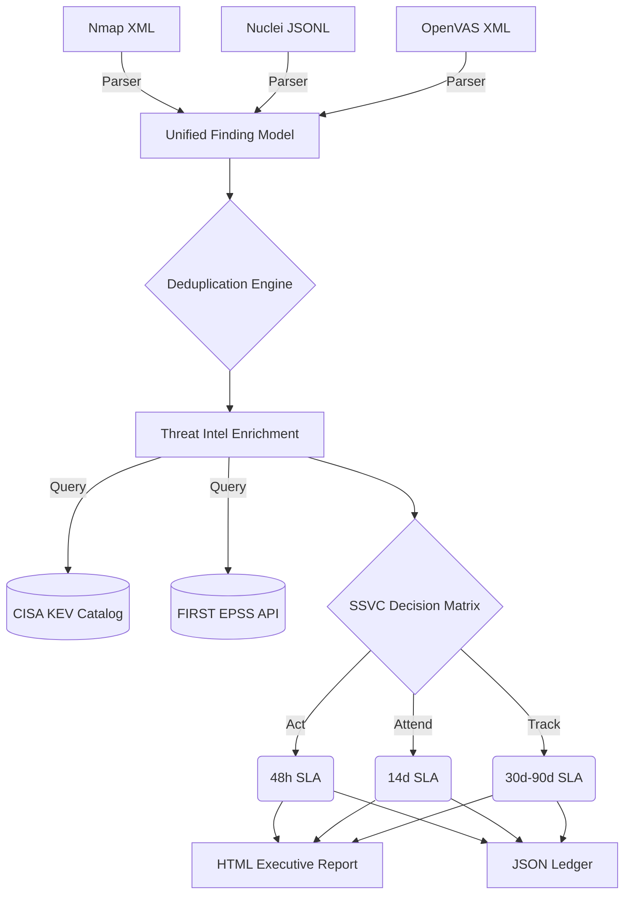

# Vuln2Risk: Risk-Based Vulnerability Prioritization Pipeline 🎯🛡️

Vuln2Risk is an automated security engineering pipeline designed to solve the critical industry problem of **vulnerability alert fatigue**.

Modern vulnerability scanners (Nmap, Nuclei, OpenVAS, Nessus) often generate hundreds of raw alerts per host. Vuln2Risk ingests cross-scanner data, unifies the findings into a common data model, deduplicates overlapping alerts, and enriches them with real-time Threat Intelligence to prioritize remediation based on actual exploitability rather than theoretical severity.

---

## 🌟 Key Features & Methodology

Vuln2Risk moves beyond static CVSS scores by implementing a multi-stage data processing and decision architecture:

1. **Multi-Scanner Ingestion & Normalization:** Parses raw XML/JSONL outputs from distinct security tools (Nmap, Nuclei, OpenVAS).
2. **Intelligent Deduplication:** Aggregates findings by `Target IP + Port + CVE`, rolling up hundreds of raw scanner hits.
3. **Real-Time Threat Enrichment:**
   - **CISA KEV:** Cross-references findings against the Cybersecurity and Infrastructure Security Agency's catalog of Known Exploited Vulnerabilities.
   - **FIRST EPSS:** Queries the Exploit Prediction Scoring System API to assign a dynamic probability (0–100%) of wild exploitation.
4. **SSVC Decision Engine:** Implements the CISA Stakeholder-Specific Vulnerability Categorization (SSVC) decision tree to calculate SLA timelines.
5. **Actionable Reporting:** Generates a machine-readable JSON ledger and a styled, human-readable HTML Executive Report.

---

## 🧠 System Architecture Diagram



---

## 🚀 Installation & Local Usage

Ensure you have Python 3.8+ installed.

```bash
# Clone the repository
git clone https://github.com/alrightatharva/vuln2risk.git
cd vuln2risk

# Install dependencies (Rich for CLI UI, PyTest for testing)
pip install -r requirements.txt

# Run the pipeline
python vuln2risk.py --nmap sample_data/nmap_scan2.xml --nuclei sample_data/report1.json --criticality High --internet-facing
```

---

## 🐳 Docker Deployment

Vuln2Risk is fully containerized, allowing you to run the pipeline without configuring a local Python environment.

### 1. Build the Docker Image

```bash
docker build -t vuln2risk .
```

### 2. Run the Container (with Volume Mapping)

Because the container is isolated, you must map your local data and report directories using the `-v` flag so the tool can read your scans and save the output to your host machine.

**Linux / macOS:**

```bash
docker run --rm \
  -v $(pwd)/sample_data:/app/sample_data \
  -v $(pwd)/reports:/app/reports \
  vuln2risk --nmap sample_data/nmap_scan2.xml --nuclei sample_data/report1.json --criticality High --internet-facing
```

**Windows (PowerShell):**

```powershell
docker run --rm `
  -v ${PWD}/sample_data:/app/sample_data `
  -v ${PWD}/reports:/app/reports `
  vuln2risk --nmap sample_data/nmap_scan2.xml --nuclei sample_data/report1.json --criticality High --internet-facing
```

---

## ⚙️ Command Line Arguments

| Argument | Description | Default |
|---|---|---|
| `--nmap` | Path to Nmap XML output file | None |
| `--nuclei` | Path to Nuclei JSONL output file | None |
| `--openvas` | Path to OpenVAS XML output file | None |
| `--criticality` | Asset business value (`Low`, `Medium`, `High`, `Critical`) | Medium |
| `--internet-facing` | Flag to indicate if the host is exposed to the WAN | False |
| `--report-id` | Custom identifier for generated output files | Timestamp |

---

## 📊 Example Output

Vuln2Risk transforms verbose scanner output into concise, actionable metrics. For example, a recent scan generated **463 raw findings**. Vuln2Risk deduplicated this down to **44 component upgrades**, with only **11 requiring immediate (ACT) remediation**.

**Rich CLI Interface:**

```
╭───────────────────────────────────────────╮
│ Vuln2Risk | Security Engineering Pipeline │
╰───────────────────────────────────────────╯
[+] Loaded 1734 known exploited CVEs from CISA KEV.
[*] Querying EPSS API for exploit probabilities...

              Actionable Findings Summary
┏━━━━━━━━━━━━━━━━━━━━━━━━┳━━━━━━━━━━┳━━━━━━━━━━━━━━━━━┓
┃ SSVC Decision          ┃   SLA    ┃ Component Count ┃
┡━━━━━━━━━━━━━━━━━━━━━━━━╇━━━━━━━━━━╇━━━━━━━━━━━━━━━━━┩
│ ACT (Immediate Action) │ 48 Hours │              11 │
│ ATTEND (Prioritize)    │ 14 Days  │               1 │
│ TRACK (Next Sprint)    │ 30 Days  │               0 │
│ TRACK (Standard Cycle) │ 90 Days  │              32 │
└────────────────────────┴──────────┴─────────────────┘

✔ JSON Ledger saved to: reports/findings_20261005_191543.json
✔ Assessment report generated at: reports/vuln2risk_report_20261005_191543.html
```

---

## 📂 Project Structure

```
vuln2risk/
├── vuln2risk.py            # Main CLI entrypoint
├── core/
│   └── models.py           # Unified Dataclasses and Enums
├── parsers/
│   ├── nmap.py             # Nmap XML parsing
│   ├── nuclei.py           # Nuclei JSONL parsing
│   └── openvas.py          # OpenVAS XML parsing
├── enrichment/
│   └── vulners_api.py      # KEV parsing and EPSS API client
├── ssvc/
│   └── decision.py         # SSVC decision tree logic
├── reporters/
│   └── generator.py        # HTML and JSON output generation
├── tests/
│   └── test_ssvc.py        # PyTest unit tests for decision matrix
├── Dockerfile              # Container deployment instructions
└── requirements.txt        # Python dependencies
```

---

## 📜 License

This project is open-source and available under the [MIT License](LICENSE).
